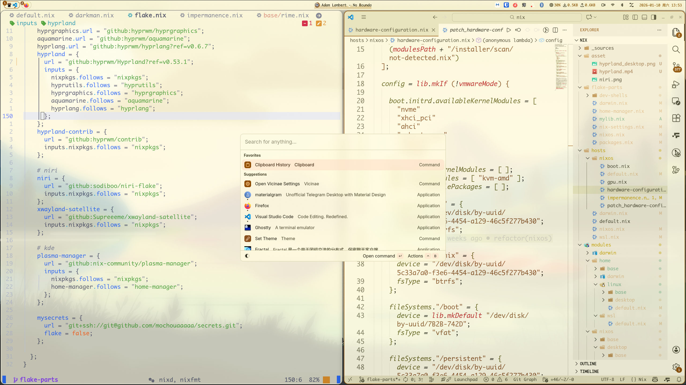

# Nix Starter Config

## Install

```bash

# curl --proto '=https' --tlsv1.2 -sSf -L https://install.determinate.systems/nix | sh -s -- install --determinate
# or

sh <(curl -L https://nixos.org/nix/install)
```

### Darwin

```base
nix profile install github:LnL7/nix-darwin

```

### Wsl

```bash
https://github.com/nix-community/NixOS-WSL
```

## Components

|                             | NixOS(Wayland)                                                                            |
| --------------------------- | ----------------------------------------------------------------------------------------- |
| **Window Manager**          | [Hyprland][Hyprland] / [Niri][Niri] / [Kde][Kde] / [Gnome][Gnome]                         |
| **Desktop Shell**           | [noctalia][noctalia] / [caelestia][caelestia] / [dankMaterial][dankMaterial]              |
| **Terminal Emulator**       | [Kitty][Kitty] / [Wezterm][Wezterm]                                                       |
| **Application Launcher**    | [vicinae][vicinae]                                                                        |
| **network management tool** | [NetworkManager][NetworkManager]                                                          |
| **Input method framework**  | [Fcitx5][Fcitx5] + [rime][rime] + [oh-my-rime][oh-my-rime] + [WanxiangGRAM][WanxiangGRAM] |
| **System resource monitor** | [Btop][Btop]                                                                              |
| **File Manager**            | [Yazi][Yazi] + [nautilus][nautilus]                                                       |
| **Shell**                   | [Zsh][Zsh] + [p10k][p10k]                                                                 |
| **Media Player**            | [mpv][mpv]                                                                                |
| **Text Editor**             | [Neovim][Neovim]                                                                          |
| **Fonts**                   | [Nerd fonts][Nerd fonts]                                                                  |
| **Image Viewer**            | [imv][imv] + [loupe][loupe]                                                               |
| **Screenshot Software**     | [grimblast][grimblast]                                                                    |
| **Screen Recording**        | [OBS][OBS] + [Kooha][Kooha]                                                               |

## Screenshot



## 

## 目录结构

<details>
    <summary>目录结构</summary>

```
.
├───.envrc
├───.gitignore
├───config.nix
├───devenv.lock
├───devenv.nix
├───devenv.yaml
├───flake.lock
├───flake.nix
├───justfile
├───nvfetcher.toml
├───outputs.nix
├───README.md
├───_sources/
├───asset/
├───flake-parts/
│   ├───darwin.nix
│   ├───home-manager.nix
│   ├───mylib.nix
│   ├───nix-settings.nix
│   ├───nixos.nix
│   ├───packages.nix
│   └───dev-shells/
├───hosts/
│   ├───darwin.nix
│   ├───default.nix
│   ├───nixos.nix
│   └───wsl.nix
├───modules/
│   ├───darwin/
│   ├───home/
│   ├───nixos/
│   └───sharedModules/
├───overlays/
│   ├───default.nix
│   └───pkgs/
└───secrets/
    ├───home.nix
    ├───nixos.nix
    └───secrets.nix
```

**关键目录说明 (Description of Key Directories):**

- **`flake-parts/`**: 包含 `flake.nix` 的可重用组件,用于组织不同系统和功能(如软件包和 shell)的设置。(Contains reusable components for `flake.nix`, organizing settings for different systems and functionalities like packages and shells.)
- **`hosts/`**: 存放特定于主机的配置。每个子目录或文件对应于不同的计算机(例如,`nixos`, `darwin`, `wsl`)。(Holds host-specific configurations. Each subdirectory or file corresponds to a different machine (e.g., `nixos`, `darwin`, `wsl`).)
- **`modules/`**: 包含在不同主机之间共享的 NixOS和 home-manager 模块。这里配置系统服务、桌面环境和用户级程序。(Contains NixOS and home-manager modules that are shared across different hosts. This is where system services, desktop environments, and user-level programs are configured.)
- **`overlays/`**: 用于添加新软件包或修改现有软件包。这样可以轻松自定义软件包集。(Used to add new packages or modify existing ones. This allows for easy customization of the package set.)
- **`secrets/`**: 使用 `agenix` 管理敏感数据。(Manages sensitive data using `agenix`.)

</details>

## Usage

<details>
<summary>Macos Build</summary>

```bash
# nix-darwin
just switch

# home-manager
just home-darwin
```

</details>

<details>
<summary>Linux Build</summary>

```bash
# linux
just home-hyprland # or home-gnome, home-kde, home-niri


```

</details>

<details>
<summary>Nixos Build</summary>

```bash
# nixos
just nixos-hyprland # or nixos-gnome, nixos-kde, nixos-niri

# home-manager
just home-hyprland # or home-gnome, home-kde, home-niri

```

</details>

<details>
<summary>Wsl Build</summary>

```bash
nix develop .#defailt
just swl
```

</details>

[Hyprland]: https://github.com/hyprwm/Hyprland
[Niri]: https://github.com/YaLTeR/niri
[Kde]: https://kde.org
[Gnome]: https://www.gnome.org
[noctalia]: https://github.com/noctalia-dev/noctalia-shell
[caelestia]: https://github.com/caelestia-dots/shell
[dankMaterial]: https://github.com/AvengeMedia/DankMaterialShell
[Kitty]: https://github.com/kovidgoyal/kitty
[Wezterm]: https://github.com/wezterm/wezterm
[Fcitx5]: https://github.com/fcitx/fcitx5
[rime]: https://rime.im
[oh-my-rime]: https://github.com/Mintimate/oh-my-rime
[Zsh]: https://www.zsh.org/
[p10k]: https://github.com/romkatv/powerlevel10k
[vicinae]: https://github.com/vicinaehq/vicinae
[WanxiangGRAM]: https://github.com/amzxyz/RIME-LMDG
[Btop]: https://github.com/aristocratos/btop
[mpv]: https://github.com/mpv-player/mpv
[imv]: https://sr.ht/~exec64/imv
[Neovim]: https://github.com/neovim/neovim
[loupe]: https://gitlab.gnome.org/GNOME/loupe
[OBS]: https://obsproject.com
[nautilus]: https://apps.gnome.org/zh-CN/Nautilus
[Yazi]: https://github.com/sxyazi/yazi
[Kooha]: https://github.com/SeaDve/Kooha
[grimblast]: https://github.com/hyprwm/contrib
[NetworkManager]: https://wiki.gnome.org/Projects/NetworkManager
[Nerd fonts]: https://github.com/ryanoasis/nerd-fonts
