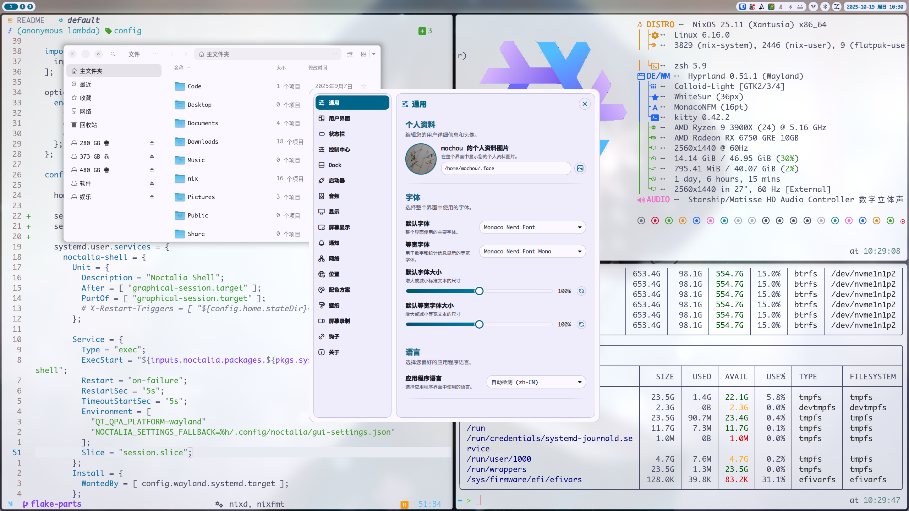
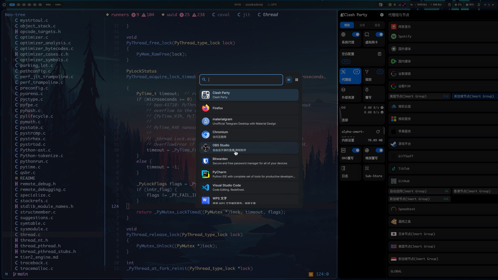

# Nix Starter Config

## Install

```bash

# curl --proto '=https' --tlsv1.2 -sSf -L https://install.determinate.systems/nix | sh -s -- install --determinate
# or

sh <(curl -L https://nixos.org/nix/install)
```

# Darwin

```base
nix profile install github:LnL7/nix-darwin

```

## Components

|                             | NixOS(Wayland)                                                    |
| --------------------------- | ----------------------------------------------------------------- |
| **Window Manager**          | [Hyprland][Hyprland] / [Niri][Niri] / [Kde][Kde] / [Gnome][Gnome] |
| **Terminal Emulator**       | [Kitty][Kitty]/[Wezterm][Weztemr]                                 |
| **network management tool** | [NetworkManager][NetworkManager]                                  |
| **Input method framework**  | [Fcitx5][Fcitx5] + [rime][rime] + [WanxiangGRAM][WanxiangGRAM]    |
| **System resource monitor** | [Btop][Btop]                                                      |
| **File Manager**            | [Yazi][Yazi] + [nautilus][nautilus]                               |
| **Shell**                   | [Zsh][Zsh] + [p10k][p10k]                                         |
| **Media Player**            | [mpv][mpv]                                                        |
| **Text Editor**             | [Neovim][Neovim]                                                  |
| **Fonts**                   | [Nerd fonts][Nerd fonts]                                          |
| **Image Viewer**            | [imv][imv] + [loupe][loupe]                                       |
| **Screenshot Software**     | [grimblast][grimblast]                                            |
| **Screen Recording**        | [OBS][OBS] + [Kooha][Kooha]                                       |

## Screenshot



## 

## 目录结构

<details>
    <summary>目录结构</summary>

```bash

├── config.nix
├── flake.lock
├── flake.nix
├── flake-parts
│   ├── darwin.nix               # nix-darwin
│   ├── default.nix
│   ├── dev-shells               # shell环境
│   ├── home-manager.nix         # home-manager
│   ├── imports.nix              # import
│   ├── nixos.nix                # nixos
│   ├── nix-settings.nix         # nix-settings
│   └── packages.nix             # nixpkgs
├── hosts         # 主机配置文件
│   ├── darwin.nix   # darwin主机配置入口文件
│   ├── default.nix
│   ├── nixos    # nixos主机配置文件
│   └── nixos.nix   # nixos主机配置入口文件
├── justfile      # 启动脚本
├── modules       # 模块
│   ├── darwin       # darwin模块
│   ├── default.nix
│   ├── home         # home-manager模块
│   ├── nixos         # nixos模块
│   └── sharedModule  # 共享模块
├── nvfetcher.toml
├── outputs.nix
├── overlays      # overlays
│   ├── darwin.nix
│   ├── default.nix
│   ├── home-manager.nix
│   ├── nixos.nix
│   └── pkgs
├── packages      # custom build pkgs
│   └── default.nix
├── README.md
└── _sources     # pin pkgs
    ├── generated.json
    └── generated.nix
```

</details>

## Usage

<details>
<summary>Macos Build</summary>

```bash
# nix-darwin
just switch

# home-manager
just home-darwin
```

</details>

<details>
<summary>Linux Build</summary>

```bash
# nixos
just nixos-hyprland # or nixos-gnome, nixos-kde, nixos-niri


```

</details>

<details>
<summary>Nixos Build</summary>

```bash
# nixos
just nixos-hyprland # or nixos-gnome, nixos-kde, nixos-niri

# home-manager
just home-hyprland # or home-gnome, home-kde, home-niri

```

</details>

<details>
<summary>Wsl Build</summary>

```bash
nix develop .#defailt
just swl
```

</details>

# Todo

- [ ] hyprland上在浏览器输入框里无法使用super+a,c,v,x等快捷键操作，而其他桌面环境正常
